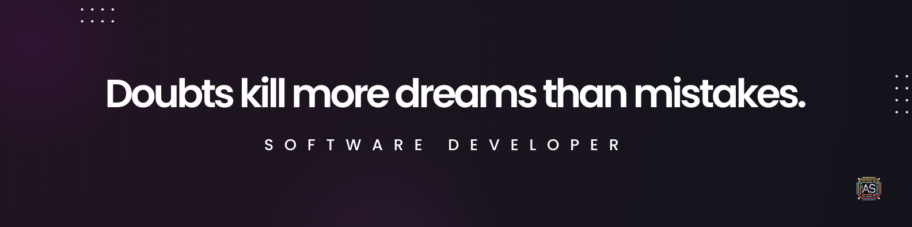

  

###

  
  
  

###

<h1 align="center">Hi there 👋, I'm Alejandro</h1>

###

<h3 align="left">👩‍💻  About Me</h3>

###

💼 Passionate Software Developer, Focused on creating and innovating digital products. 📈 Experience in Backend, frontend, and mobile development. ❤️ Values, Innovate in sideprojects 🤯, Learn continuously 🥸, obsession defeats talent 😠💬 Mission: Advise and guide people to achieve their goals and grow professionally.

###

<h3 align="left">🌱 My IKIGAI</h3>

###

❤️ Love helping people 🯠Facing challenges 🚀 Creating startups 👨â€ğŸ« Mentoring 💡 Passionate about creating and innovating 🌟 Vocation: Develop digital products that generate a positive impact

###

<h3 align="left">🚀 My Goals</h3>

###

1. Continue innovating in software development and digital products. 2. Expand my personal brand and presence on social media. 3. Help more people through mentoring and advising. 4. Develop more open-source projects that benefit the community.

###

<h3 align="left">🛠 Language and tools</h3>

###

  
  
  
  
  
  
  
  
  
  
  
  
  
  
  
  
  
  
  
  
  
  
  
  
  
  
  
  
  
  
  
  
  
  
  
  
  
  
  

###

<h3 align="left">🔥   My Stats :</h3>

###

  

###

  
  
  
  

###